## 3. Layer 1 Bitübertragung (Physical)

Der Layer 1 im ISO/OSI Schichtenmodell wird als Bitübertragungsschicht oder Physical Layer bezeichnet. Wie auf den oberen Bildern gesehen stellt es die unterste Schicht des Modelles dar und definiert mechanische, physikalische und elektrische Eigenschaften dar für die Übertragung von Informationen in Bits.

Die Hauptaufgabe der Schicht 1 ist es sicherzustellen das, dass empfangende Gerät die 0 und 1 zuverlässig erkennen kann. Diese 0 und 1 werden aber nicht immer über das gleiche Medium gesendet. Da es für Layer 1 mehrere Übertragungsmedien und Optionen gibt, beispielsweise kabelgebunden oder kabellose Medien beeinflusst die oberen Layer nicht. Auch wenn die Übertragungsart austauscht.

Die Hardware auf dieser Schicht unterscheiden sich durch passiven und aktiven Komponenten. Passive Komponenten sind z. B. Stecker, Buchsen, Leitungen und Antennen. Aktive Komponenten sin z. B. Hubs, Verstärker oder Netzwerkkarte.

### 3.1 Twisted Pair Kabel (UTP / FTP / STP)

Bei Kupferverkabelung wird heute meistens das Twisted Pair Kabel mit vier verdrillten Adern Paaren verwendet. Twisted Pair Kabel (TB-Kabel) sind genormt und sind in Klassen und Kategorien eingeteilt, um ihre Leistungsfähigkeit zu beschreiben. In der internationalen Norm (ISO 11801) spricht man von Kategorien. Hingegen in der europäischen Norm (EN 50173) werden die Kabel in Klassen A-F eingeteilt.

In der Netzwerktechnik werden vor allem Kabel der Klasse D-F (Kategorie 5-7 Mit der Englischen Abkürzung Cat) verwendet.

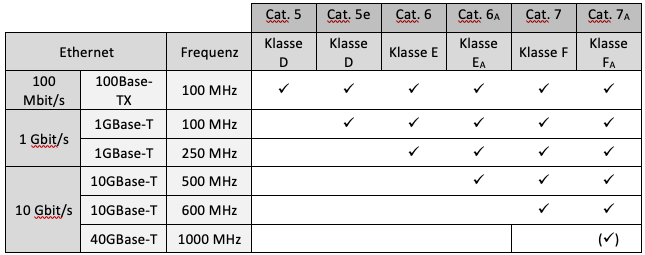

Kategorien und Klassen hat man erstellt, um die Leistungsfähigkeit einer einzelnen Komponente zu beschreiben. Ausserdem ist es leichter für die Klassifizierung, damit ein Kabel einer Kategorie zugewiesen werden kann, dessen spezifischen Anforderung Profile es entspricht.  

Da die alten Bezeichnungen nicht einheitlich und verwirrend waren, wurde im Jahr 2002 ein neues Bezeichnungsschema in der Form XX/YZZ eingeführt. Mit diesen Bezeichnungen kann man die Abschirmung des Kabels, rasch erkennen.

Weshalb die Abschirmung überhaupt nötig?

Dies ist wegen des Stroms, der durch die Kabel fliest. Um die Daten vollständig von einem Gerät zu dem andern zu senden, muss das empfangende Gerät ohne Probleme die Bits 0 und 1 erkennen können, sollte jetzt aber der Strom eines anderen Kabels, das Nebenan anliegt, auch wenn nur für eine kurze Zeit rüber springen, gibt dies dann ein durcheinander. Deshalb schirmt man die Kabel ab, aber nicht nur die Kabel selbst, sondern auch die 4-Adernpaare, die sich im Kabel befinden.

**Bedeutung der Beschriftung:**

- **XX (Gesamtschirmung):**

    * U = Ungeschirmt (unshielded)
    * F = Folienschirm (foiled)
    * S = Geflechtschirm (screened)
    * SF = Geflecht- und Folienschirm

- **Y (Aderpaarschirmung):**

    * U = Ungeschirmt
    * F = Folienschirm
    * S = Geflechtschirm

- **ZZ:**

    * TP = Tweisted Pair

#### 3.1.1 UPD, STP, S/UTP und S/FTP

=== "UTP"

    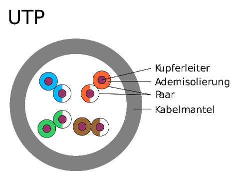

    Ein UTP Kabel hat keine Gesamtschirmung und ungeschirmte Paare.

=== "STP"

    

    Wenn man das STP Kabel mit dem UTP Kabel (Abbildung 3) vergleicht, sieht man, dass beim STP Kabel die Paare geschirmt sind mit einem Geflechtschirm.

=== "S/UTP"

    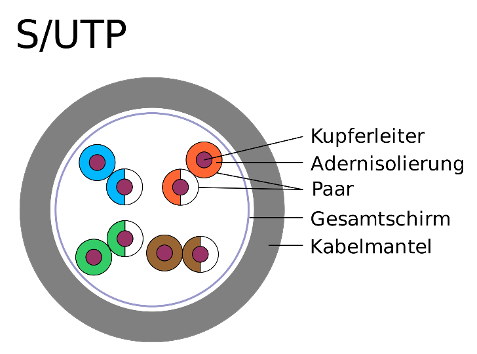

    Beim S/UTP Kabel gibt es eine Gesamtschirmung (S = Geflecht).

=== "S/FTP"

    

    Hier beim S/FTP sieht man das die Paare sowohl auch die Gesamtschirmung gemacht sind.

**Beispiele:**

=== "ungeschirmt"

    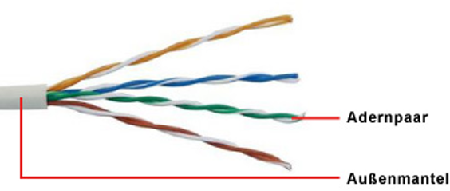

=== "geschirmt"

    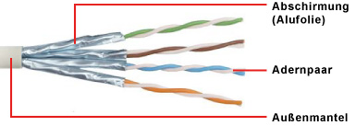

### 3.2 RJ45 Stecker

RJ45 ist die übliche Steckverbindung für die TB-Kabel. Einige RJ45 Stecker sind speziell entwickelt, damit sie bis Cat. 6A eingesetzt werden können. Somit kann der Stecker bis zu 10 Gigabit Ethernet verwendet werden, dafür aber nur bis zu 100 Meter. GG45- oder der Tera-Stecker sind potenziell Nachfolger für Netzte mit Cat. 7.

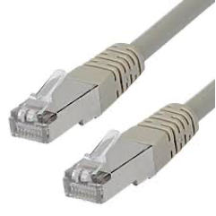{: style="height:150px"}

### 3.3 RJ45 Stecker Belegung

TIA-568A und TIA-568B sind die zwei Standards für die Stecker Belegung bei RJ45.Beide verdrahten die Kontakte direkt durch. Das bedeutet, dass der Kontakt 1 auf der einen Seite direkt mit dem Kontakt1 auf der anderen Seite verbunden ist. Dies ist bei allen 8 gleich.$

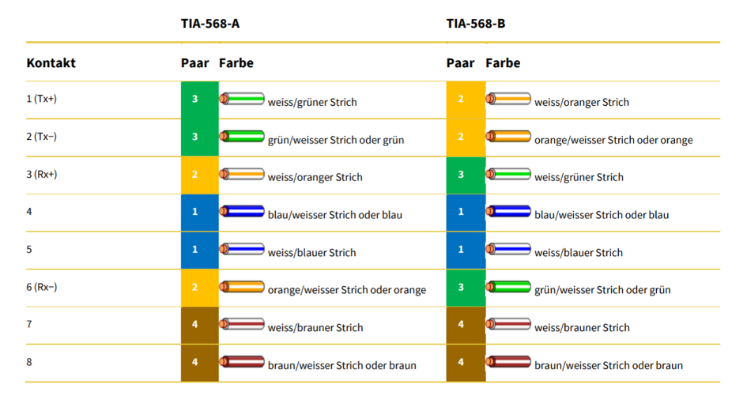

### 3.4 Lichtwellenleiter

Lichtwellenleiter (Glasfaserkabel) werden heute vor allem in der primären und sekundären Verkabelung gebraucht. Glasfaserkabel sind bestens geeignet für schnelle Übertragung von grossen Datenmengen und die Kabel bieten vollständige Abschirmung gegen elektromagnetische Störungen. Da Lichtsignale über mehrere Kilometer übertragen werden können und auch weitere Distanzen erreichen als Kupferkabel gibt es einige Nachteile. Einige davon wären, dass die Glasfaserkabel teurer sind, man vorsichtiger mit ihnen umgehen muss, da sie schnell kaputtgehen können und dass auch keine Stromübertragung möglich ist.

#### 3.4.1 Fastertypen

Die Lichtwellenleiter (LWL) gibt es als Multimodefaser und Monomodfaser (Multi- und Singlemode). Wobei Multimode vor allem im Nahbereich verwendet wird (nicht wie bei Kupferkabel z. B. von Dose zu Gerät, sondern im Nahbereich von Gebäude zu Gebäude) und Singlemode kann auch im Nahbereich verwendet werden aber wird vor allem im Fernbereich benutzt.

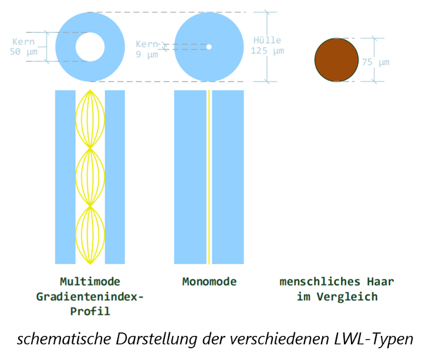{: style="height:450px"}

In der Multimode Faser wandern mehrere Lichtmodulationen (Photonen) gleichzeitig im Faserkern. Dies kann bei Kabellängen über 900 m zu Störungen im Kable geben.

Bei der Singlemode Faser erlaubt die reduzierte Grösse des Faserkerns jeweils nur die Übertragung von einzelnen Photonen zur selben Zeit. Durch den kleinen Kern und der Übertragung einzelnen Lichtmodulationen .

#### 3.4.2 Tabellen Übersicht Fastertypen

{: style="height:350px"}

#### 3.4.3 MM Faserklassen (GbE)

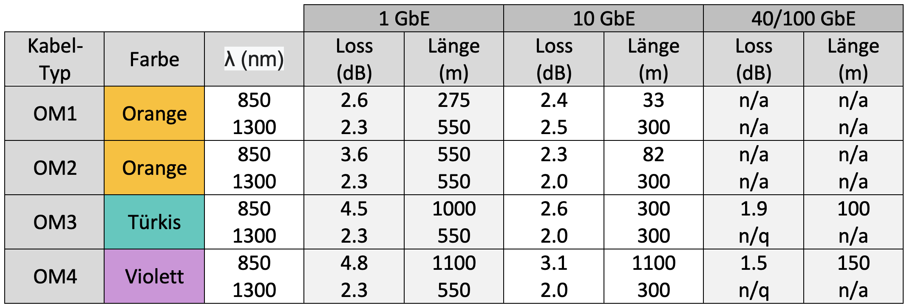

#### 3.4.4 Tabellen Übersicht Stecker Aufteilung SM/MM

### 3.5 LWL-Stecker

#### 3.5.1 SC-Stecker

Der subscriber connector Stecker, abgekürzt SC-Stecker wurde in Japan entwickelt und löste im Jahre 2002 den ST-Stecker aus den Normen EN50173 und ISO 11801 als Standard für LAN-Verkabelungen ab.

=== "Duplex-SC-Stecker 1"

    { align=left }

    Duplex-SC-Stecker Multimode mit sichtbaren Ferrulen.

=== "Duplex-SC-Stecker 2"

    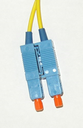{ align=left }

    Duplex-SC-Stecker Monomode mit Schutzkappen.

#### 3.5.2 LC-Stecker

Der LC-Stecker (engl. lucent connector) ist ein Small-Form-Factor-Stecker.

=== " LC-Stecker Beispiel 1"

    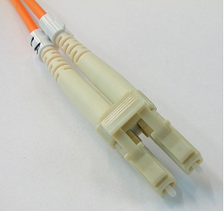

=== "LC-Stecker Beispiel 2"

    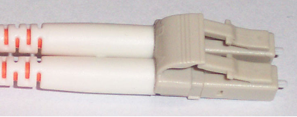

#### 3.5.3 MTP-Stecker

Der MTP-Stecker ist ein weiterentwickelter MPO-Stecker. Bei dieser Bezeichnung handelt sich ist ein eingetragenes Warenzeichen von US Conec. Während der MPO-Stecker in Europa bekannter ist, ist es der MTP-Stecker in den USA.

=== "MTP-Stecker Beispiel 1"

    

=== "MTP-Stecker Beispiel 2"

    

#### 3.5.4 Übersicht verschiedener Stecker

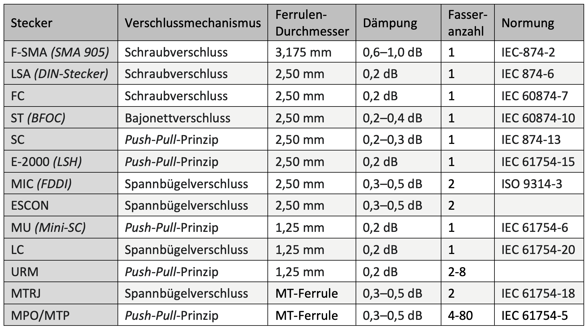{: style="height:350px"}

### 3.6 Fiber connector

{: style="height:150px"}
