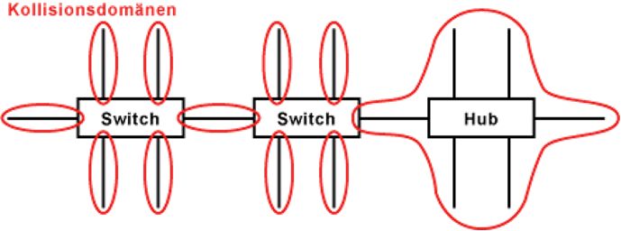
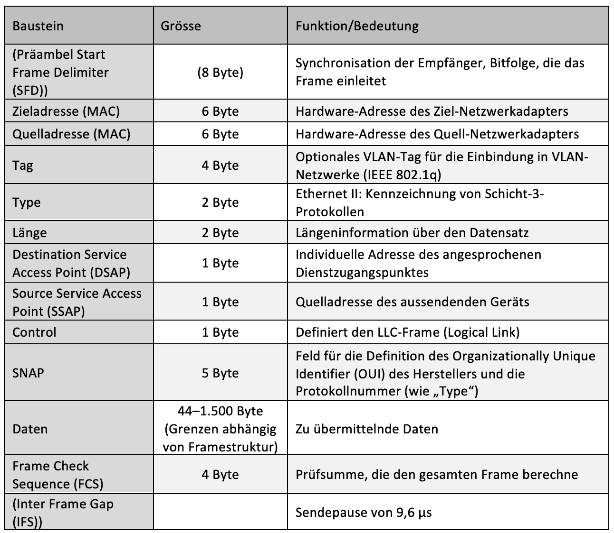
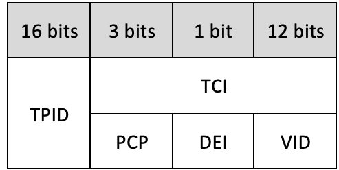
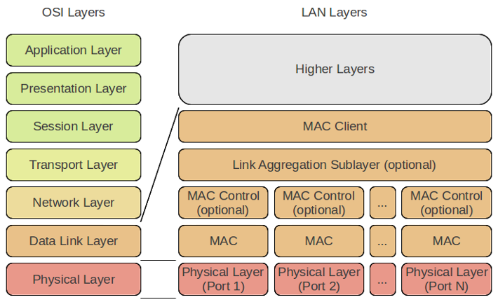

## 4. Layer 2 Sicherung (Data Link)

Die Sicherungsschicht oder auch Data Link Layer genannt ermöglicht, dass zwei Systeme, Daten in Form von Bitfolgen zuverlässig auf einem Übertragungsabschnitt austauschen können und dies ohne eine Überlastung der Strecke.
Der Zugriff auf das Übertragungsmedium regelt die Schicht 2, damit eingeschlossen ist das anzuwendende Zugriffsverfahren und die Adressierung. Aber die Voraussetzung, damit die Layer 2 diese Aufgabe erfüllen kann, wie auch die Fehlerkorrektur oder die Flusskontrolle, ist die Aufteilung des Bitstroms aus der Layer 1 in Frames.

### 4.1 Ethernet

Ethernet ist der Standard in Datennetzwerken. Es wurde in den 1970er Jahren entwickelt und seither ein wenig erweitert, das Frameformat von 1980 gilt aber weiterhin. Das Institute of Electrical and Electronics Engineers (IEEE) legt in den Standards der 802.3 Reihe die vielen verschiedenen Ausprägungen der Ethernet Standards fest. Mit Ethernet macht das Austauschen von Daten im Netzwerk möglich.

### 4.2 Zugriffsverfahren

CSMA/CD aus geschrieben für Carrier Sense Multiple Access with Collision Detecion. Ist ein Zugriffsverfahren von Ethernet, bei dem mehrere im gleichen Netzwerk auf das Übertragungsmedium zugreifen können.

**Besser Beschrieben:**

- **Carrier Sense** (Träger-Zustandserkennung): Jede Station prüft, ob das Übertragungsmedium frei ist.

- **Multiple Access** (Mehrfachzugriff): Mehrere Stationen teilen sich das Übertragungsmedium.

- **Collision Detection** (Kollisionserkennung): Wenn mehrere Stationen gleichzeitig senden, erkennen sie die Kollision.

Ethernet verwendet die Methode Carrier Sense Multiple Access/Collision Detection. Aber wie funktionier CSMA/DC eigentlich?

Damit können die Geräte die Signalträgerleitung abwechselnd verwenden. Ist ein Gerät bereit zur Übertragung, dann prüft es das Signalniveau der Leitung. So findet es heraus, ob die Leitung bereits benutzt wird oder nicht. Sollte es bereit in Benutzung sein, wartet das Gerät und versucht es zu einem späteren Zeitpunkt noch einmal (Dieser Zeitpunkt kann in diesem Fall auch nur einige Sekunden sein). Ist die Leitung frei, überträgt das Gerät sofort. Zwei Geräte können allerdings auch hier gleichzeitig Daten senden. Sollte das der Fall sein, kommt es zu einer Kollision. Kurz gesagt, jedes Gerät wartet also, bis eine Leitung frei ist, um zu Übertragen nach dem Prinzip (Listen-bevor-Talk) und bei Leitungen, die in Benutzung sind, probiert es in zufälligen Zeitspannen so lange, bis die Leitung frei ist.

### 4.3 Kollisionen

In einem Ethernet-Netzwerk mit Half Duplex kommt eine Kollision zustande, wenn zwei Geräte im gleichen Netzwerk versuchen, Daten zur gleichen Zeit zu übertragen. Also sind Kollisionen im Grunde nur Störungen. Diese sind nicht allzu schlimm, da die Geräte nach einer Erkennung einer Kollision ihre Daten wieder übermittelten. Sollte es aber mehrfach und andauernd zu mehreren Kollisionen kommen, könnte dies zu einem Problem werden. Die Anzahl auf mögliche Kollisionen steigt bei der Anzahl Geräte, die das gleiche Übertragungsmedium brauchen wollen.

Weshalb die möglichen Kollisionen steigen bei der Anzahl Geräte ist, weil diese zwar die Leitungen prüfen aber durch lange Leitungen und andere Sachen könnte es sein das mehrere Geräte verschiedenen Signal Laufzeiten wahrnehmen. Dies kann dazu Führern das Ein Gerät nach der Überprüfung einer freien Leitung ihr Signal sendet, obwohl das Signal eines anderen Geräts schon unterwegs ist. Solange die Bandbreite von Ethernet nicht mehr als 30% ausgereizt wird, machen sich Kollisionen kaum bemerkbar. Mit steigender Belastung des Netzwerks nehmen aber auch die Kollisionen zu. Hier hilft nur, die Anzahl der Stationen zu reduzieren oder das gesamte Netzwerk in Teilnetz aufzuteilen.

Wie oben schon kurz erwähnt gibt Ethernet-Netzwerke mit Halbduplex aber auch Vollduplex. Halbduplex-Ethernet basiert auf dem CSMA/CD-Verfahren. Es handelt sich dabei um das ursprüngliche Ethernet bis 10 MBit/s. Vollduplex-Ethernet ist eine Weiterentwicklung, die als Fast- Ethernet bezeichnet wird und auf CSMA/CD verzichtet. Auch alle weiteren Ethernet-Entwicklungen arbeiten im Vollduplex-Betrieb. Die Stationen kommunizieren über Punkt-zu-Punkt-Verbindungen direkt miteinander.

Weil Fast-Ethernet in der Regel im Vollduplex-Modus arbeitet und damit auf CSMA/CD verzichtet, ist eine zusätzliche Flusskontrolle erforderlich. Dafür gibt es einen eigenen Standard: IEEE 802.3x (Flow Control).

### 4.4 Frame

In einem Ethernet-Netzwerk teilen Geräte untereinander Datenpakete, die auch Ethernet-Pakete genannt werden. In dem ist auch das Ethernet-Frame (Deutsch oft als Datenframe bezeichnet). Diese Datensätze bestehen aus Binärcode, die wichtigen Informationen weiter gibt wie Adressen, Steuerinformationen, Nutzdaten und Prüfsummen.

Da es mehrere Ethernet-Standarte gibt, gibt es auch unterschiedliche aufgebaute Ethernet Frames. Die grundsätzlich gleich aufgebaut sind aber trotzdem einige Abweichungen voneinander haben die zum Beispiel abhängig vom Netzwerkprotokoll sind.

**Ethernet IEEE 802.3**

=== "Ohne Tag"

    

=== "Mit Tag"

    

    In der Abbildung sieht man, dass sich zwischen der Quellad. und Länge ein Tag vorhanden ist. Das Tag Feld enthält wichtige Informationen über die VLAN Einbindung.

#### 4.4.1 Frame Bausteine

#### 4.4.2 Ethernet-Paket Struktur

Ein Datenpaket auf der Leitung und der Frame als Nutzdaten bestehen aus Binärdaten. Ethernet überträgt Daten mit dem höchstwertigen Oktett (Byte) zuerst, innerhalb jedes Oktetts wird jedoch das niedrigste wertige Bit zuerst übertragen.

Der interne Aufbau eines Ethernet-Frames ist in IEEE 802.3 spezifiziert. Die folgende Tabelle zeigt das komplette Ethernet-Paket.

### 4.5 Tag im Ethernet Frame

Im 802.1 Q-Standard sind Datenfelder für das VLAN-Tagging definiert, die im Ethernet Paket im Datenberiech eingeführt werden. Das Tag besteht aus vier Feldern welche zusammen 32 Bit beträgt. Für den Tag Protocol Identifier (TPID) werden zwei Byte, für den Priority Code Point (PCP) drei Bit, für den Drop Eligible Indicator (DEI) ein Bit und für die VLAN-ID (VID) zwölf Bit genutzt.

Das TPID-Datenfeld wird bei 802.1Q-VLANs immer auf den Wert {==81 00==} hex gesetzt, dieser Wert ist reserviert.

-	**TPID** = Tag Protocol Identifier
-	**TCI** = Tag Control Information
-	**PCP** = Priority Code Point
-	**DEI** = Drop Eligible Indicator
-	**VID** = VLAN-Identifier

**Beschreibung:**

**TPID** (Tag Protocol Identifier):
Ein 16-Bit-Feld, das auf einen Wert von 0x8100 gesetzt ist, um den Frame als einen Frame mit IEEE 802.1Q-Tag zu identifizieren. Dieses Feld befindet sich in ungetaggten Frames an derselben Position wie das EtherType-Feld und wird daher verwendet, um den Frame von ungetaggten Frames zu unterscheiden

**TCI** (Tag Control Information):
Ein 16-Bit-Feld mit PCP, DIE und VID als Unterfeldern.

**PCP** (Priority Code Point):
Das PCP-Datenfeld umfasst drei Bits, die die Frame-Priorität kennzeichnen.

**DEI** (Drop Eligible Indicator):
Das 1 Bit grosse DEI Feld, früher noch CFI. Kann separat oder in Verbindung mit PCP verwendet werden, um Rahmen anzuzeigen, die bei Vorliegen einer Überlastung fallengelassen werden können

**VID** (VLAN-Identifier):
Ein 12-Bit-Feld, das das VLAN angibt, zu dem der Frame gehört. Die Werte 0 und 4095 (0x000 und 0xFFF in hex) sind reserviert. Alle anderen Werte können als VLAN-Identifier verwendet werden, wodurch bis zu 4.094 VLANs möglich sind. Der reservierte Wert 0x000 zeigt an, dass der Frame keine VLAN-ID trägt; in diesem Fall spezifiziert das 802.1Q-Tag nur eine Priorität (in PCP- und DEI-Feldern) und wird als Prioritäts-Tag bezeichnet.

Diese Tags werden gemacht um zwischen den VLANs zu unterscheiden. Jedem VLAN wird eine eindeutige Nummer zugeteilt (VLAN-ID). Dadurch kann dann ein Gerät das zum VLAN mit der ID=4 gehört mit allen anderen Geräten im gleichen VLAN kommunizieren. Jedoch nicht mit Geräten die sich im VLAN mit der ID= 5 oder 6 befinden. Insgesamt sind 4096 – 2 VLANs möglich.

### 4.6 Link Aggregation

Link Aggregation ist ein Standard zur parallelen Bündelung von mehreren Netzwerkverbindungen. Vorteile einer Link Aggregation gegenüber einer Verbindung über ein einzelnes Kabel ist die höhere Übertragungsgeschwindigkeit wie auch die Ausfahlsicherheit.

**Was ist LAG und wie funktioniert es?**

LAG ist eine aktuelle Technik. Eine Link Aggregation Group bildet sich, wenn wir mehrere Ports parallel zwischen zwei Switches schalten und als LAG konfigurieren. LAG baut mehrere Verbindungen zwischen zwei Switches auf, wodurch die Bandbreite erweitert wird.
Es bietet Redundanz auf Verbindungsebene bei Netzwerkfehlern und Verkehr. Auch wenn eine Verbindung ausfällt, werden die übrigen Verbindungen zwischen den beiden Switches weiterhin gehen. Sie übernehmen auch den Verkehr, der über den nicht funktionierenden laufen soll, damit Datenpakete nicht verloren gehen.

**Wo befindet sich der Link Aggregation?**

Innerhalb des Data Link Layers (Sicherungsschicht) implementiert, konkret zwischen dem MAC Client und MAC Sublayern.

**Static Link Aggregation**

Bei der statischen Link Aggregation werden alle Konfigurationsparameter einmalig auf beiden beteiligten Komponenten einer LAG eingerichtet.

**Dynamic Link Aggregation - Link Aggregation Control Protocol (LACP)**

Das Link Aggregation Control Protocol (LACP) erlaubt den Austausch von Informationen bezüglich der Link Aggregation zwischen den zwei Mitgliedern einer Link Aggregation. Diese Informationen werden in LACPDUs (Link Aggregation Control Protocol Data Units) verpackt.

Bei LACP kann jeder einzelne Port als **Active LACP** oder **Passive LACP** konfiguriert werden:

=== "Passive LACP"

    Der Port bevorzugt von sich aus keine LACPDUs zu übertragen. Nur wenn die Gegenseite Active LACP hat, überträgt der Port LACPDUs (preference not to speak unless spoken to).

=== "Active LACP"

    Der Port bevorzugt LACPDUs zu übertragen. Unabhängig davon, ob die Gegenseite Passive LACP hat oder nicht.
