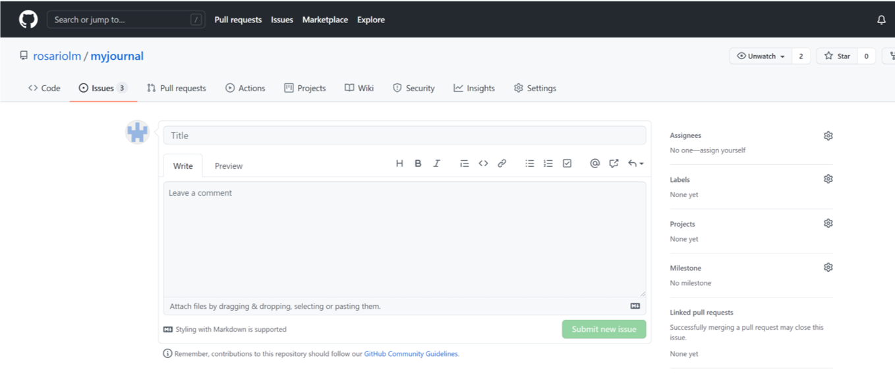
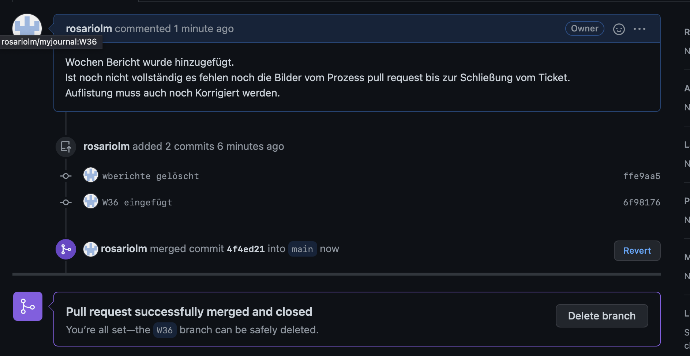

# Workflow

*Wochenbericht KW36*

1.Ticket auf github erstellen. Unter "Issue"/"New Issue"


Bei der Erstellung passender Titel wählen, Assignees und Labels setzen. Eine kurze Beschreibung wenn möglich auch.




2.Branch Erstellen und auch direkt aud den neu erstellten branch wechseln:

```bash
git checkout -b Issue_number
```

!!! info
    Die Issue number als branch name zu verwenden ist optional. Es hat den Vorteil das man bei mehreren branches den Überblick nicht verliert.


3.Bearbeitung starten. Der  unten aufgelistete Befehe und die shortcuts können bei der Bearbeitung behilflich sein.

=== "Befehl"

    _Datei mit vim öffnen um die angegebene Datei zu  Bearbeiten_:

    ```bash
    vim datei_name
    ```

=== "Shortcuts"

    * a/A Bearbeitung starten
    * :wq Abspeichern und Datei schliessen
    * :w Abspeichern


4.Nach der Bearbeitung adden und commiten.

=== "add"

    ```bash
    git add .
    ```

=== "commit"

    ```bash
    git commit -m "beschreibung"
    ```

5.Mit dem unteren befehl pushen (pull request).

```bash
git push origin branch_name
```

Angezeigter link kann nun im Browser eingegeben werden.


6.Am besten Änderungen und gemachtes beschreiben und das dazu gehörige Ticket erwähnen.


7.Der pull request anehmen.





8.Mit den zwei unteren Befehlen zurück auf den main branch wechseln und der issue branch löschen.

=== "Auf main wechseln"

    ```bash
    git checkout main
    ```

=== "branch löschen"

    ```bash
    git branch -d branch_name
    ```


9.Ticket auf github schliessen.


!!! warning
    Bevor man weiter arbeitet auf main ein pull machen und danach noch den branch auf github löschen.
