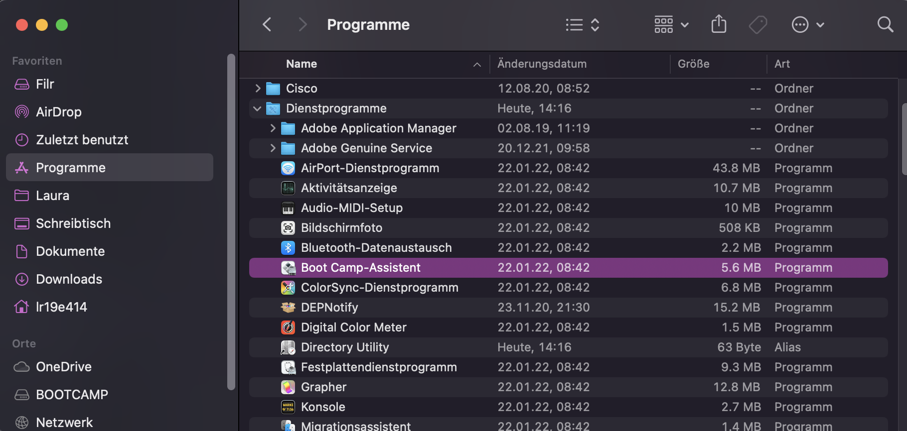

# Windows 10 mit dem Boot Camp-Assistenten auf einem Mac installieren

*Wochenbericht KW6*

## Voraussetzungen für die Installation von Windows 10 auf einem Mac

- MacBook von 2015 oder neuer
- MacBook Air von 2012 oder neuer
- MacBook Pro von 2012 oder neuer
- Mac mini von 2012 oder neuer

- iMac von 2012 oder neuer1
- iMac Pro (alle Modelle)
- Mac Pro von 2013 oder neuer

!!! warning Anforderung
    Mindestens 64 GB freien Speicherplatz auf dem Startvolume des Mac.

## 1. Einstellung für "Sicheres Starten" prüfen

Vor der Installation von Windows sollte man die Einstellung auf "Volle Sicherheit" stellen. Nach der Installation von Windows kann man mit jeder Einstellung für "Sicheres Starten" von Windows aus starten.[Link zur Anleitung um sicheres Starten überprüfen.](https://support.apple.com/de-de/HT208198)

## 2. Mit dem Boot Camp-Assistenten eine Windows-Partition erstellen

Vom Finder aus zu **Programme > Dienstprogramme > Boot Camp-Assistent** navigieren. Dort den Boot Camp-Assistent starten.

- Wenn der Boot Camp-Assistent dazu auffordert, die Größe der Windows-Partition festzulegen, muss man die oben genante mind. grösse berücksichtigen.

!!! warning Anforderung
    Die Partitionsgrösse kann später nicht mehr geändert werden.

## 3. Windows-Partition (BOOTCAMP) formatieren

Nach der Ausführung des Boot Camp-Assistenten wird der Mac neu gestartet und kehrt zum Installationsprogramm zurück. Wenn man nach dem Installationsprogramm gefragt wird, wo Windows installiert werden soll, muss man die BOOTCAMP-Partition an wählen, und dan auf "Formatieren" klicken.

!!! info
    In den meisten Fällen wird die richtige BOOTCAMP-Partition vom Installationsprogramm automatisch ausgewählt und formatiert.

## 4. Windows installieren

Nun am besten alle externen Geräte, die während der Installation nicht benötigt werden  trennen. Dann auf "Weiter" klicken. Folgend den Anweisungen auf dem Bildschirm folgen, um Windows zu installieren.

## 5. Boot Camp-Installationsprogramm unter Windows verwenden

Nach Abschluss der Windows-Installation wird der Mac unter Windows gestartet und das Fenster "Willkommen beim Boot Camp-Installationsprogramm" geöffnet. Nach dem beflogen der Anweisungen auf dem Bildschirm, werden die Boot Camp- und Windows-Support-Software (Treiber)installiert. Sobald dies fertig ist, wird man dazu aufgefordert, den Computer neu zu starten.

## Wechsel zwischen Mac und Windows

Um zwischen den beiden zu wechseln, muss man bei einem Neustart, die Wahltaste (oder die Alt-Taste) ⌥ während des Startvorgangs gedrückt halten. [Link zur kurz Anleitung von Apple.](https://support.apple.com/de-de/HT208123)
