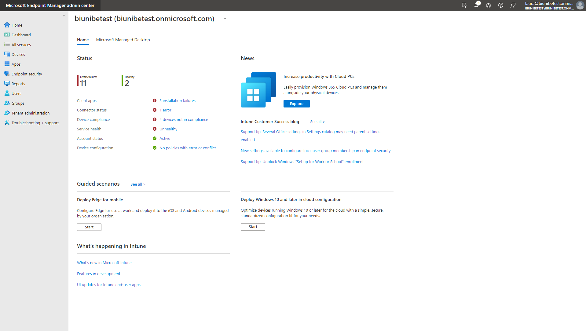
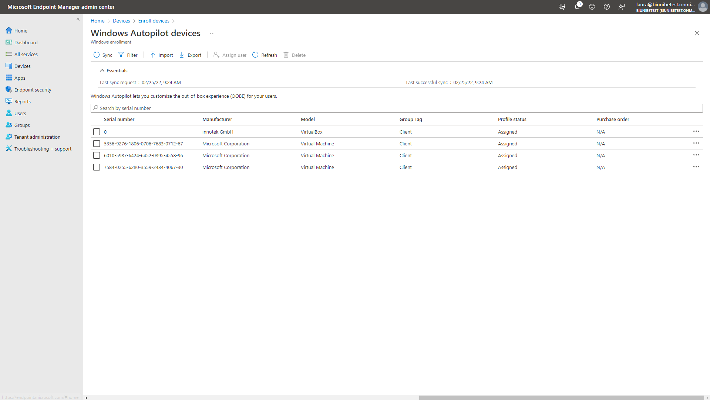
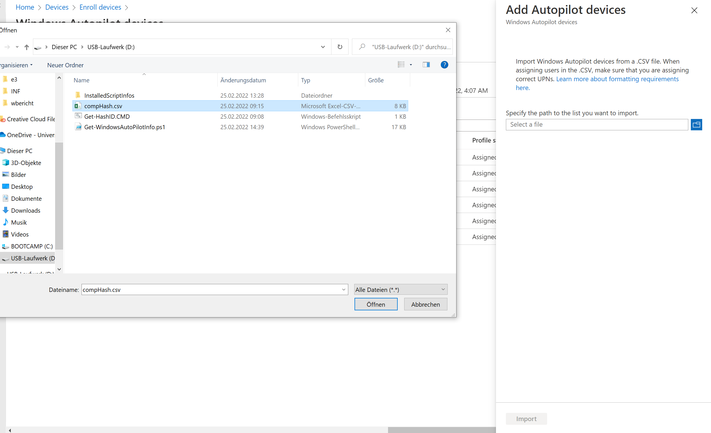
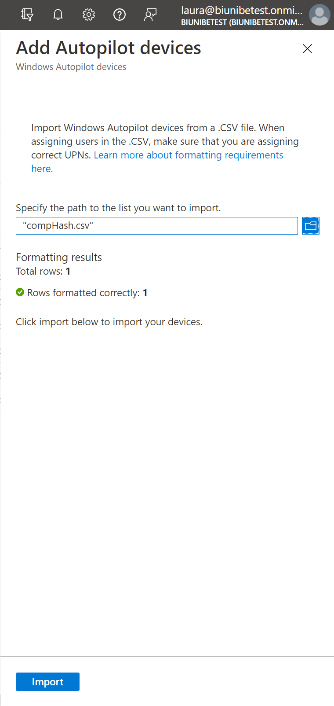

*Wochenbericht KW7*

Bevor man in Intune das Gerät importieren kann. Muss ein Script auf dem jeweiligen Gerät ausgeführt werden.

## Auf dem Gerät

### 1. Wie auf [THE LAZY ADMINISTRATOR](https://www.thelazyadministrator.com/2020/01/27/get-a-new-computers-auto-pilot-hash-without-going-through-the-out-of-box-experience-oobe/) das Script herunterladen und am besten auf einem USB-Stick speichern, für weiteren gebrauch.

### 2. Nach dem Download fehlte bei mir noch ein CMD feil welches ich kopiert habe.

### 3. Nun kann das Get-WindowsAutoPilotInfo.ps1 ausgeführt werden. *Als Admin ausführen!*

### 4. Nun sollte eine compHas.csv erstanden sein, welche man für den Intune schritt braucht.

## In Intune

### 1. Zuerst muss man vom Home aus zu **Devices > Windows > Windows enrollment > Devices** navigieren.

### 2. Auf der **Windows Autopilot devices** Seite *Import* anwählen.

### 3. Hier nun die erstellte compHash.csv angeben.

=== "Schritt 1"

     {: style="height:550px"}

=== "Schritt 2"

     

=== "Schritt 3"

     {: style="height:550px"}

### 4. Nach einigen Minuten sollte das Gerät neu auf der Liste erscheinen.

